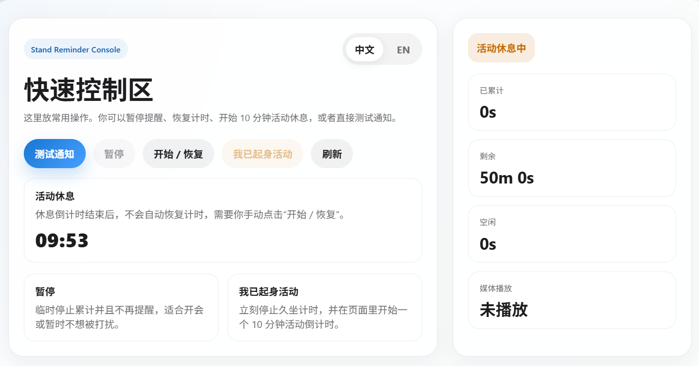
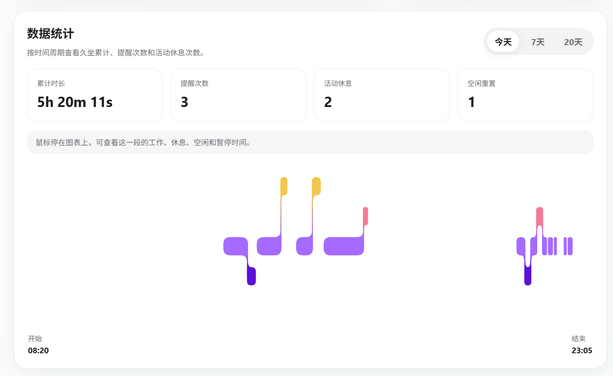
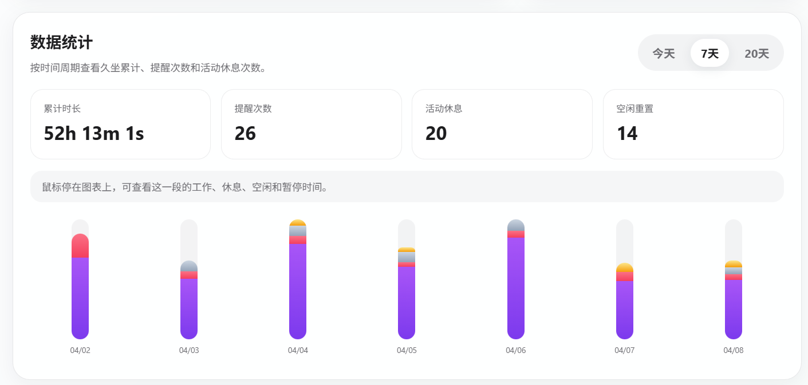
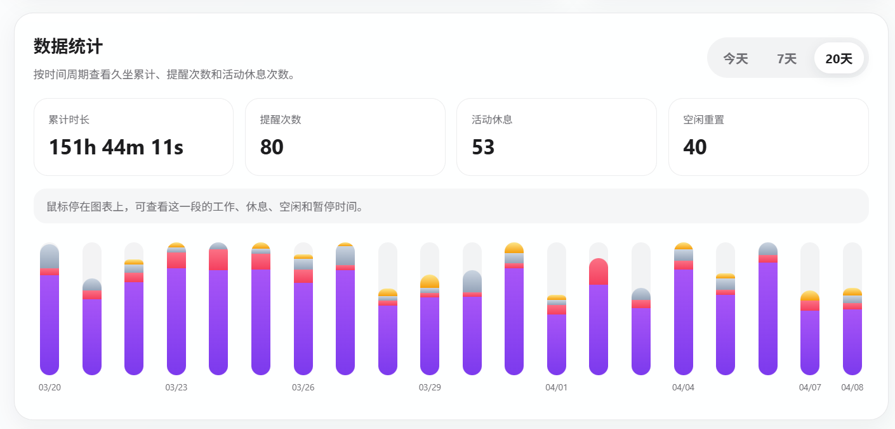
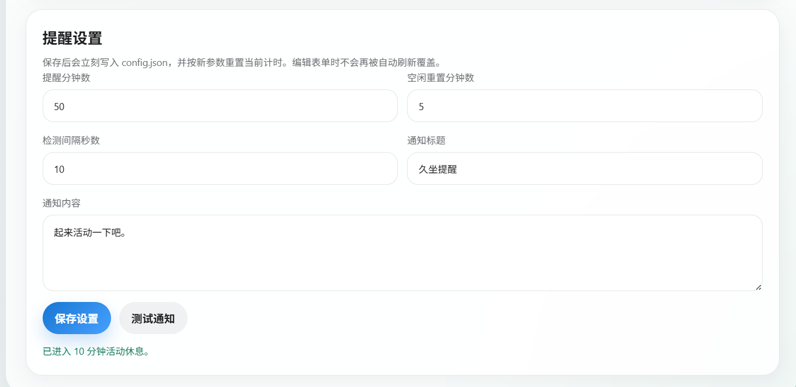

# Stand Reminder

Stand Reminder 是一个使用 Go 编写的轻量级 Windows 久坐提醒工具。

它会常驻系统托盘，检测鼠标和键盘活动，在你连续使用电脑达到设定时长后发送系统通知；同时提供一个本地网页控制中心，用来查看当前状态、调整提醒参数、管理休息流程，以及查看统计图表。

## 现有功能及开发计划

|      |      功能名      | 状态 |
| :--: | :--------------: | :--: |
|  1   |     久坐提醒     |  ✅   |
|  2   |  多语言切换  |  ✅   |
|  3   |  个性化通知  |  ✅   |
|  4   | 数据记录分析 |  ✅   |
|  5   |     开机自启     |  ✅   |
|  6   |     神秘系统     |  ☐   |


## UI 展示

### 控制中心首页



### 统计视图







### 提醒设置



## 功能说明

- Windows 托盘常驻运行，启动后不弹黑色终端窗口
- 检测键盘与鼠标活动，按连续使用时长进行久坐提醒
- 到达阈值后发送 Windows 系统通知，点击通知可打开控制中心
- 提供本地网页控制中心，默认地址为 `http://127.0.0.1:47831`
- 支持修改提醒分钟数、空闲重置分钟数、检测间隔、通知标题和通知内容
- 支持手动 `暂停`、`开始 / 恢复`、`我已起身活动`
- “我已起身活动”会停止当前计时，并在前端显示一个 10 分钟活动倒计时
- 支持中英文界面切换，默认中文
- 支持今天、7 天、20 天统计视图

## 从 Release 下载

如果你只是想直接使用程序，推荐从 GitHub Releases 下载已经打包好的版本：

[点击前往 Releases 页面](https://github.com/sheetung/stand-Reminder/releases)

下载后解压 zip，运行其中的 `stand-reminder.exe` 即可。

## 本地运行

1. 安装 Go 1.26.1 或更高版本
2. 在项目目录执行：

```powershell
go build -ldflags='-H windowsgui' -o stand-reminder.exe .
```

3. 运行：

```powershell
.\stand-reminder.exe
```

4. 程序启动后会进入系统托盘
5. 单击托盘图标可打开控制中心

## 致谢

今天统计图的 UI 实现思路参考了 Mizuki 的文章，感谢原作者提供的设计与实现分享。

- 作者：Mizuki 链接：https://www.cnblogs.com/mizuki-vone/p/17752988.html

## 声明

- 本项目采用 MIT License 开源协议。
- 本工程由 Codex 协助编写与迭代实现。
